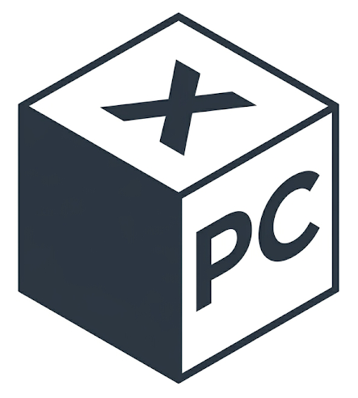
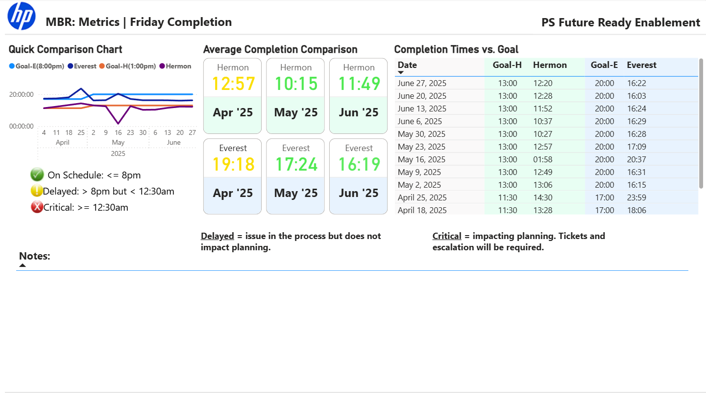
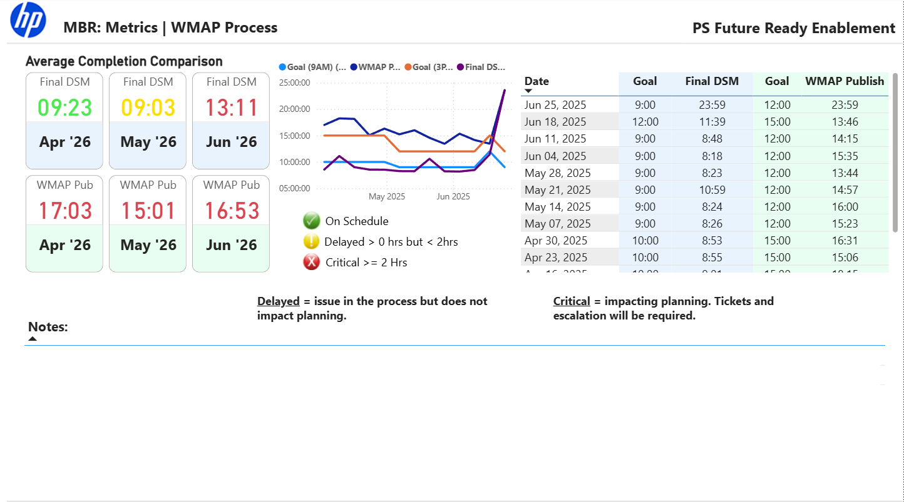
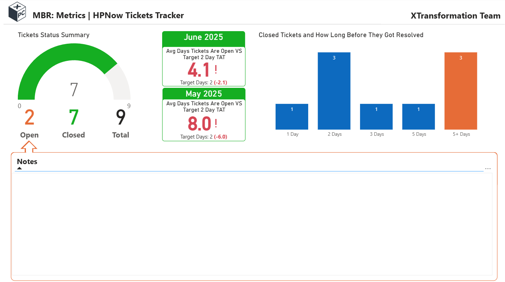
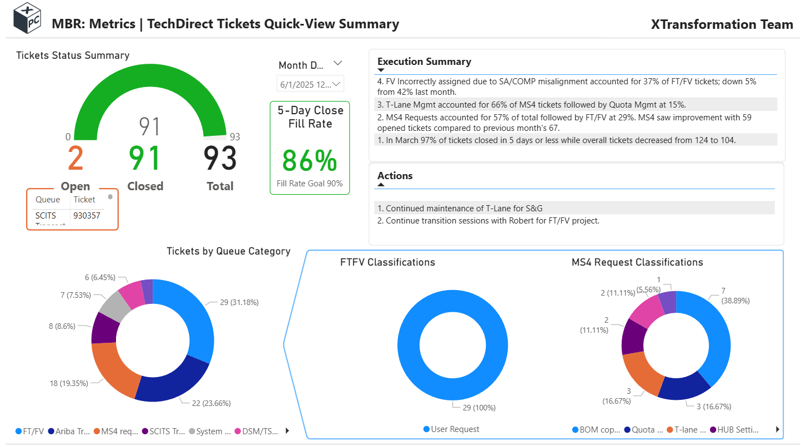
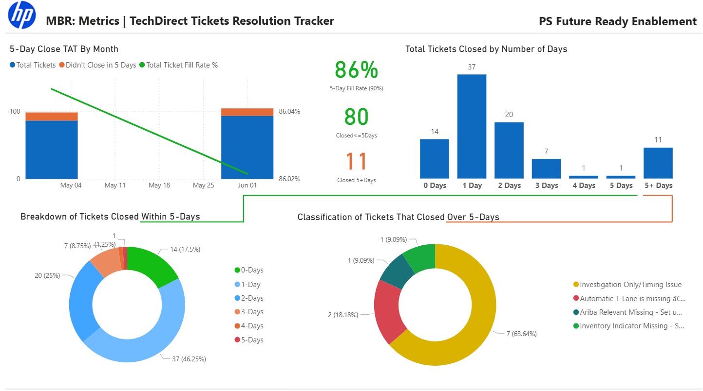
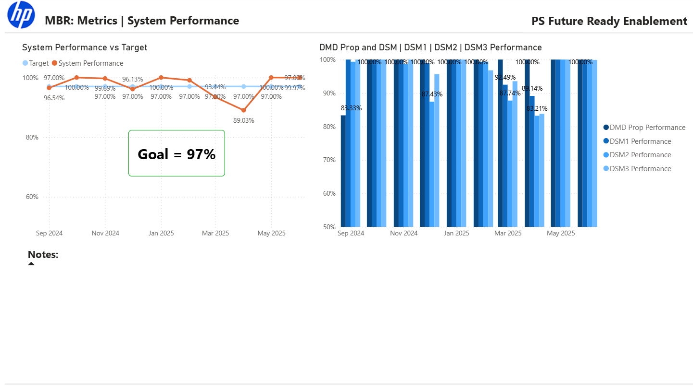
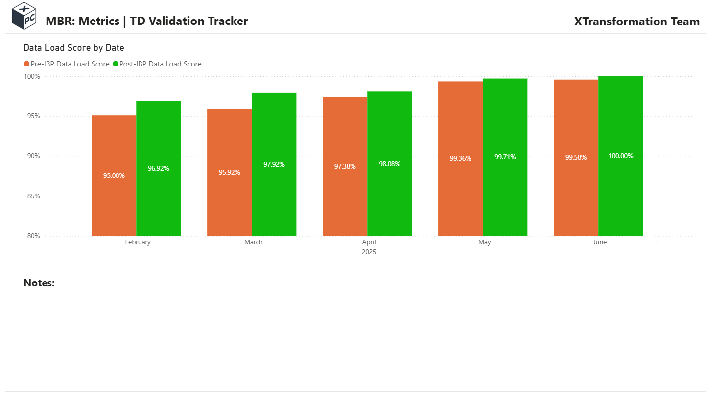

<!-- --><!--img src="Bits&Bytes-ppt-banner-logo3.png"-->

# Monthly Business Report (MBR)

A structured analysis of sales trends, growth rates, loyalty program ROI, and order economics

<b>Period:</b> FY2019 – FY2022 &nbsp;|&nbsp; <b>Team:</b> Revenue Analytics &nbsp;|&nbsp; <b>Last updated:</b> Apr 2023

---

## Executive Summary

<!-- **Strong momentum across all four metrics — three clear actions follow.** -->

  

---

  

---

  

---

  

---

  

---

  

---

  

